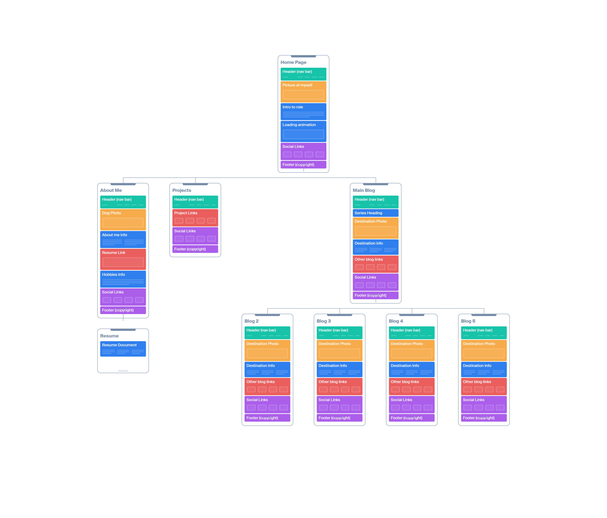
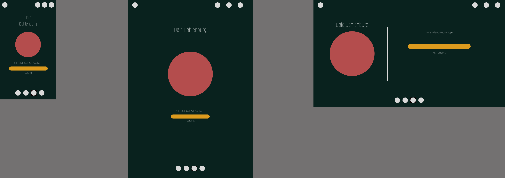
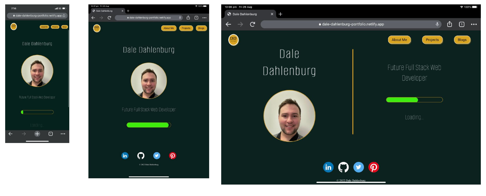
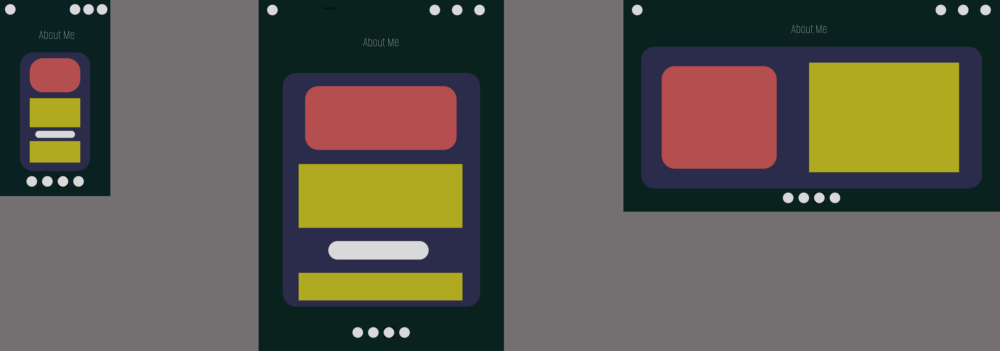
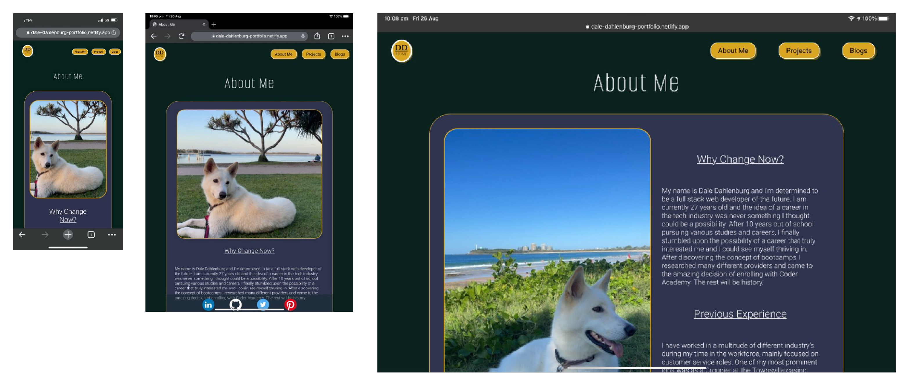
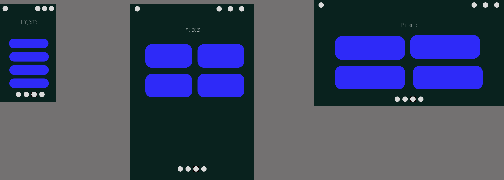
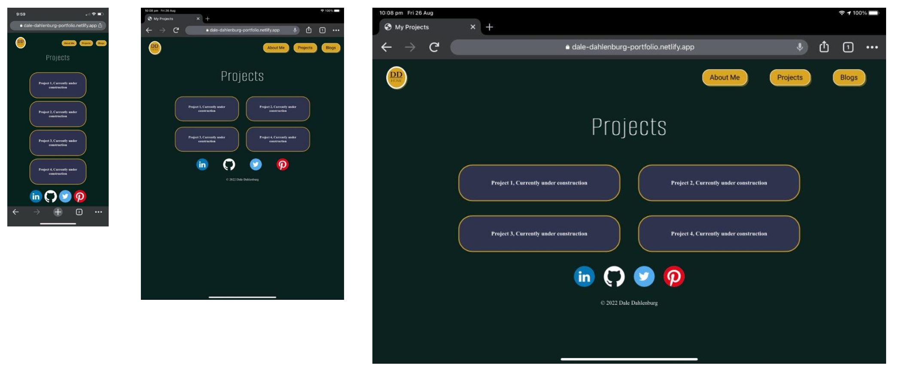
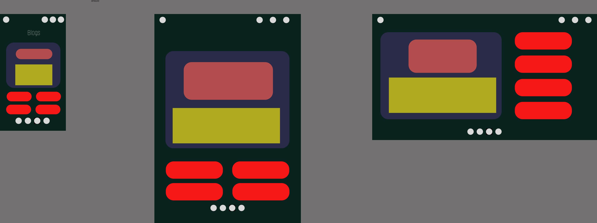
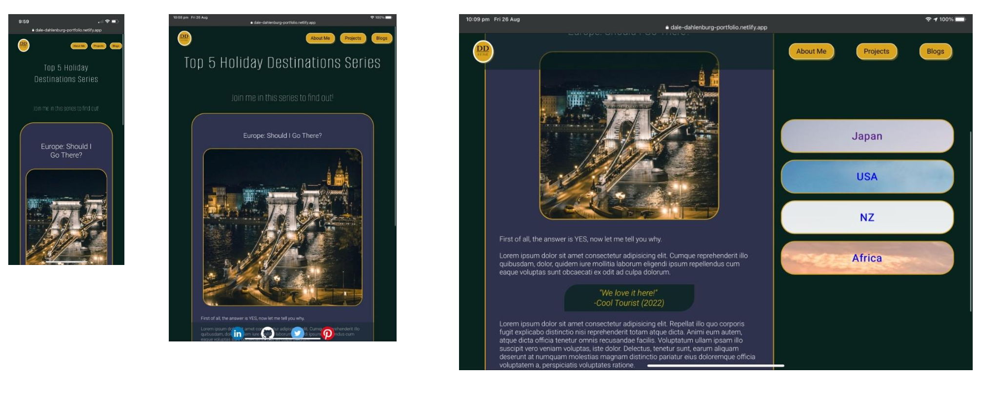

# Dale Dahlenburg Portfolio

---

## [Presentation link](https://vimeo.com/743878092)

## [Portfolio website link](https://dale-dahlenburg-portfolio.netlify.app/)

## [Github repository link](https://github.com/daledburg/dale-portfolio)

---

## Purpose
The purpose of building this website is to create a portfolio website that can be shown to prospective employers to showcase my skills. The website has links to projects I have completed throughout my education while also showing my ability to develop a funtioning and attractive website.

---

## Sitemap 
Created using Figma

Each of the main four pages can be navigated to by using the navigation menu at the top of the page. To access the other blog posts they are accessed by using a navigation menu in the blogs page themselves. Also the resume is accessed by clicking the resume button in the about me section. 

---

## Functionality and Features

The website is fully responsive between mobile, tablet and desktop screen sizes and has an easy to follow design that reflects my personal personality and style. it consists of 4 main pages;

- Index
- About me
- Projects
- Blogs

One of the first components that was designed and implemented was the main navigation bar that is at the top of all the pages. This component is comprised of links to the 4 different main pages and has a sticky property that allows the user to access the navigation even when scrolling down the page. The links are designed to resemble buttons and using the hover pseudo-class to grey out the buttons and give the user real time feedback when navigating the site.

Another component that features on all of the pages is the social links bar at the bottom of every page. This feature allows the user to navigate to external sites which are linked to personal accounts to help give a more fleshed out perception of myself. As this isn't crucial to the page itself, it isn't given the same sticky function of the nav bar and is just placed at the bottom of the page.

One of the most interesting features of the website occurs on the index page where a loading bar animation has been placed. This component was designed to be eye catching and an interesting centre piece of the index page. The animation was created using the animation feature of CSS and is on an infinite loop while the page is up. The bar is also coupled with a Loading message that fades in and out like a game loading screen.

Another interesting component of the website is the article layout of the about me page. It consists of written information about myself while also providing a picture to further provide understanding of myself as a person. The picture itself is also fully responsive as it not only changes size with different screen sizes but also changes the image provided to suit different layouts. Also included in this component is a button that links to an outside professional resume. This component is not only easily accessible but also provides all the information one would need.

---

### Index Wireframe

### Index Page

### About Me Wireframe

### About Me Page

### Projects Wireframe

### Projects Page

### Blogs Wireframe

### Blogs Page

---

## Target Audience
As stated before, the target audience for this portfolio is prospective employers and also other developers. As such, this website suggests an understanding of the technicalities surrounding building a website while also providing links to other projects to showcase other aspects of my skills. The website is also responsive mobile, tablet and desktop to support a wider range of users.

---

## Tech Stack

- HTML (Website)
- CSS (Stlying)
- Figma (Wireframes)
- Github (Repository)
- Netlify (Deployment)
- Octopus.do (Sitemap) 